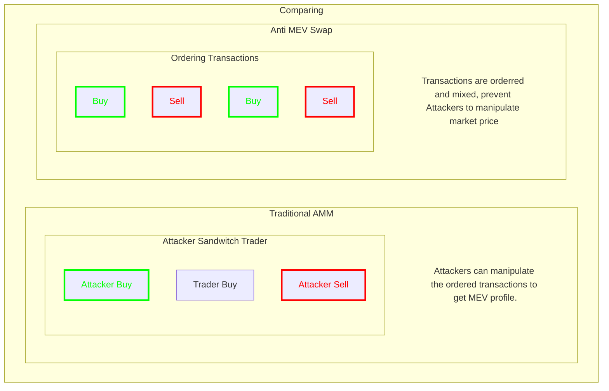

## Comparing No Sandwich Swap to Traditional DEXs

| Feature                | No Sandwich Swap      | Traditional DEXs      |
|------------------------|-----------------------|-----------------------|
| **Anti-Front-Running** | Yes                   | No                    |
| **Trade Privacy**      | Enhanced              | Limited               |
| **Order Execution**    | Ordered               | Sequential            |
| **Market Manipulation**| Mitigated             | Vulnerable            |

